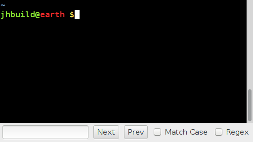

# What is Tilda?

Tilda is a terminal emulator and can be compared with other popular terminal emulators such as
gnome-terminal (Gnome), Konsole (KDE), xterm and many others. The specialities of Tilda
are that it does not behave like a normal window but instead it can be pulled up and down from the top
of the screen with a special hotkey. Additionally Tilda is highly configurable. It is possible to configure the
hotkeys for keybindings, change the appearance and many options that affect the behavior of Tilda. The screen shots
below show some of the options that Tilda provides.

## Tilda Terminal

Starting with version 1.3 Tilda will also come with a search bar. Currently we support searching forwards and backwards
as well as options to search case sensitive and to use regular expressions. The search bar can be activated from
the context menu or with a configurable hotkey that defaults to `<Ctrl><Shift>F`
## General options

## Appearance options

## Keybindings options

# Installing Tilda

Tilda should be packaged for your distribution if you are running Debian or any Debian derived distribution such as
Ubuntu or Linux Mint. For other distributions please check your package manager if it provides Tilda. You can also
install Tilda from source. For instructions to compile, install and optionally package tilda please see
**[HACKING.md](HACKING.md)**.

# Running Tilda

Once you have installed tilda, it should have automatically registered a menu entry in your desktops application menu.
Alternatively, you can run `tilda` from your command line.

The first time you run Tilda, it will create the default configuration file for
you, and show the configuration wizard. If you do not want to change any
settings, just press the "OK" button to accept the defaults.

The default keybindings to show and hide Tilda are as follows:

 * F1 - the first instance
 * F2 - the second instance
 * F3 - the third instance
 * ...

Other default keybindings are:

 * Shift-Ctrl-T - Open new tab
 * Ctrl-PageUp - Next tab
 * Ctrl-PageDown - Previous tab
 * Shift-Ctrl-W - Close current tab
 * Shift-Ctrl-Q - Exit Tilda

# Specifying your own keybinding to hide / show Tilda

We, the developers, have attempted to make the keybinding setting work with as
little trouble as possible. Some example keybindings follow:

| Keybinding String | Notes                                                             |
|-------------------|-------------------------------------------------------------------|
| `grave`           | This will use the tilde key. Many people want this.               |
| `~`               | This is the same as <Shift>grave                                  |
| `space`           | This will use the spacebar to show / hide Tilda. NOT RECOMMENDED! |
| `<Shift><Ctrl>A`  | Press Shift, Control, and the "a" key at the same time            |
| `<Shift>space`    | Press Shift and the spacebar at the same time                     |
| `<Ctrl>z`         | Press Control and the "z" key at the same time                    |

That should cover most of the cases. If you want to use something else, it
probably follows the pattern, so give it a try. Alternatively, you can use the
configuration wizard, and press the "Pull Down Terminal" button on the
"Keybindings" tab, then type the combination you want to use. Hopefully, Tilda
will be able to grab it for you. The `<TAB>` key cannot be grabbed, so at the moment
combinations such as `<Ctrl><Tab>` are not possible.

# Files that Tilda creates

Since approximately version 0.9.6 Tilda adheres to the XDG Base Directory Specification and
creates its files in the $XDG_CONFIG_HOME and $XDG_CACHE_HOME folders which normally default to
~/.config/ and ~/.cache/. Tilda will create a lock file in the cache directory
each time it starts, to keep track of how many instances are running:

    ~/.cache/tilda/locks/lock_$PID_$INSTANCE

Tilda will also create the config files in:

    ~/.config/tilda/config_$INSTANCE

where `$INSTANCE` is the number of how many instances are running and
`$PID` the process id. Tilda automatically migrates the files for you if it detects configuration file
at the old location `~/.tilda`.

# Getting more help / Questions and Comments

To get more help, you should first open a command prompt, and run `tilda
--help`. You can also take a look at the **[Wiki](https://github.com/lanoxx/tilda/wiki)**, or email
questions and comments to anyone listed in the [AUTHORS](AUTHORS) file.

# Reporting Bugs

We have done our best to make sure that Tilda is free from bugs, but it is
inevitable that we have missed some.

You may open bugs in the **[issue section](http://github.com/lanoxx/tilda/issues)** or email them to the
developers directly.

# Contributing to Tilda

Tilda is written in C with the use of the libraries **glib**, **GTK+**, **libconfuse** and **X11**.
If you would like to help us develop Tilda you can look at the issue section to see if you can help to fix an open issue.
Or you can send an email to the developers. Pull requests and patches are always welcome.

You can also look into the [TODO.md](TODO.md) file and see if there is something there that
you would like to do.
